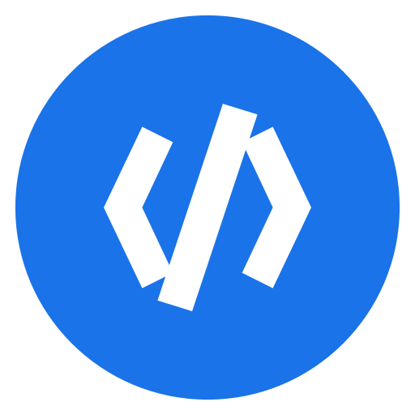
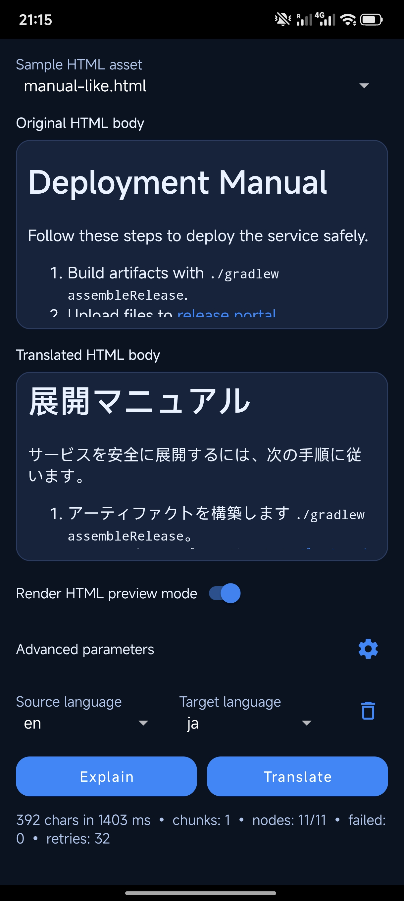

# mlkit-html-translator-android

<p align="center">
  
</p>

Android library for translating **HTML body content** with an ML-backed pipeline while preserving structure, attributes, links, and protected tags.

## Release

- Current release: **0.5.1**
- Stable surface for first public integration:
  - `MlKitHtmlTranslator`
  - `HtmlTranslationOptions`
  - `TranslationCallback`
  - `TranslationException` + `TranslationErrorCode`

## Design parity highlights

This library intentionally mirrors `mlkit-markdown-translator-android` ergonomics:

- main class + options-based construction
- callback-based `translate*` flow
- typed exception and error codes
- explicit `close()` lifecycle and optional timing report

## Integrate in your Android app (0.5.1)

### Option A: JitPack artifact

JitPack page: https://jitpack.io/#godsarmy/mlkit-html-translator-android

Add JitPack repository in your root `settings.gradle`:

```gradle
dependencyResolutionManagement {
    repositoriesMode.set(RepositoriesMode.FAIL_ON_PROJECT_REPOS)
    repositories {
        google()
        mavenCentral()
        maven { url 'https://jitpack.io' }
    }
}
```

Add dependency in your app module `build.gradle`:

```gradle
dependencies {
    implementation 'com.github.godsarmy.mlkit-html-translator-android:library:0.5.1'
}
```

### Option B: source-module integration (tag `0.5.1`)

If you prefer source integration, check out tag `0.5.1` and include this repo's `library/` module in your app workspace, then depend on it as a Gradle project module.

## Quickstart

### 1) Create translator

```java
HtmlTranslationOptions options = HtmlTranslationOptions.builder()
        .setMaxChunkChars(3000)
        .setFailurePolicy(HtmlTranslationOptions.FailurePolicy.BEST_EFFORT)
        .setMaskUrls(true)
        .setMaskPlaceholders(true)
        .setMaskPaths(true)
        .build();

MlKitHtmlTranslator translator = new MlKitHtmlTranslator(options);
```

### 2) Translate HTML body

```java
translator.translateHtml(
        "<p>Hello <a href=\"https://example.com\">world</a></p>",
        "en",
        "es",
        new TranslationCallback() {
            @Override
            public void onSuccess(@NonNull String translatedHtml) {
                // Render translated HTML
            }

            @Override
            public void onFailure(@NonNull TranslationException exception) {
                // Handle TranslationErrorCode
            }
        });
```

### 3) Close when done

```java
translator.close();
```

### Optional: explain preprocessing without translation

```java
ExplainHtmlResult explain = translator.explainHtml(
        "<p>Hello <a href=\"https://example.com\">world</a></p>");

for (ExplainHtmlChunk chunk : explain.getChunks()) {
    // inspect markerized payload, node indexes, and plain-text length
}
```

`explainHtml(...)` runs parse/collection/masking/chunking diagnostics only and does not call ML translation.

## App-owned model lifecycle

This library intentionally **does not** expose model download/list/delete APIs.

App code should manage model lifecycle (download/check/delete) via ML Kit APIs, then call `translateHtml(...)` once required models are available.

## Sample app

The `sample/` app demonstrates:

- source/target language selectors
- input/output HTML preview
- sample assets for manual-like and mixed code/prose content
- app-layer model operations (download/delete/check)
- structured error output (`TranslationErrorCode`)
- optional timing report rendering

<p align="center">
  
</p>

## User documentation

- API reference: [docs/api.md](docs/api.md)
- Integration guide: [docs/integration.md](docs/integration.md)
- Benchmark summary: [docs/bench-report.md](docs/bench-report.md)
- Architecture details: [docs/architecture.md](docs/architecture.md)
